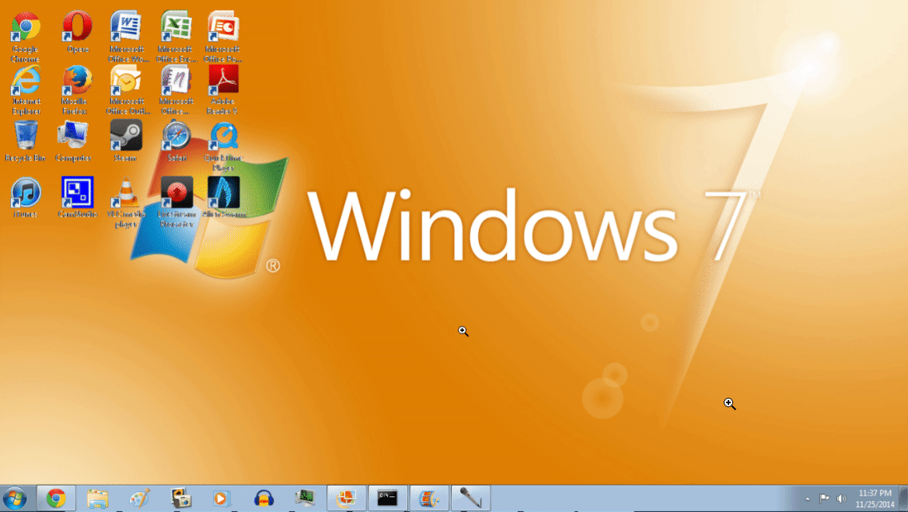

# SliderCards

Fun flash cards that slide across your screen.  Perfect for memorizing test material, or learning vocabulary in your favorite foreign language!

## Preview

## Usage

Download the [Sciter.JS](https://github.com/c-smile/sciter-js-sdk/tree/main/bin) application corresponding to your operating system.  Place it in this folder, run it, and enjoy!

Modify [cards.json](cards.json) to suit your needs.

## Todo

- [ ] Replace the graphics, specifically the card faces
- [ ] Replace the sounds, specifically the correct and incorrect dings
- [x] ~~Actually play the sound effects (waiting on next version of Sciter.JS)~~
- [x] ~~Add ability to flip card over when you can't remember the answer~~
- [ ] Use spaced repetition algorithm
- [ ] Option to customize frequency of card appearances

## Copyright

This application uses [Sciter Engine](https://sciter.com), © Terra Informatica Software, Inc.

## Attribution

Inspired by [Stretchly](https://github.com/hovancik/stretchly) and [RinyCards](https://github.com/devicedev/riny-cards).

## Contributors ✨

Thanks goes to these wonderful people:

<table>
  <tr>
    <td align="center"><a href="https://github.com/4silvertooth"> <b>4silvertooth</b></a> <a href="https://github.com/GirkovArpa/slidercards/commit/aec3251bfdd7c22770ad52e6cb4438a4b5daf39f" title="Refactoring">🔨</a>
  </tr>
</table>